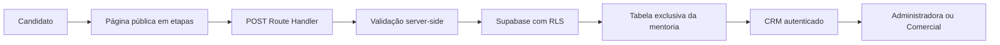

# Aplicação da Mentoria Entre Potencial e Resultado

## Objetivo

Criar uma página pública de aplicação para a **Mentoria Entre Potencial e Resultado**, com fluxo guiado em telas sequenciais, preservando o contexto da oferta e reduzindo a fricção de preenchimento. Cada aplicação deve ser armazenada integralmente em uma tabela própria no Supabase e consultável dentro do CRM por usuários administradores e comerciais.

## Decisão aprovada

> [!success] Conclusão determinada
> A aplicação será um módulo público do mesmo aplicativo Next.js do CRM, sem exigir autenticação do candidato. O envio ocorrerá por um Route Handler server-side, com validação completa e persistência em uma tabela exclusiva da mentoria. O CRM terá uma área autenticada de aplicações, consultando diretamente essa tabela; o MVP não duplicará automaticamente a aplicação na tabela `leads`.

## Experiência pública

### Rota

`/aplicacao/mentoria-entre-potencial-e-resultado`

A rota deve ser liberada no middleware apenas para a página e para o endpoint de submissão. Todas as demais rotas do CRM continuam protegidas por Supabase Auth.

### Estrutura do fluxo

Cada etapa é uma tela visualmente independente, com uma ação principal para avançar e uma ação secundária para voltar quando aplicável. Os campos são agrupados por contexto para evitar um formulário longo em uma única tela:

1. **Orientação** — título, texto integral de orientação da Uli e botão `Continuar`.
2. **Identificação** — nome completo, WhatsApp, e-mail, cidade/Estado e data de nascimento.
3. **Contexto profissional** — como conheceu a mentoria e situação profissional atual.
4. **Momento e objetivo** — motivo do interesse e resultado profissional específico para os próximos 6 a 12 meses.
5. **Obstáculo e formato** — principal obstáculo, formato de mentoria preferido e experiência prévia.
6. **Expectativa e seleção** — expectativas, motivo para ser selecionado e informação adicional.
7. **Disponibilidade e comprometimento** — disponibilidade financeira, melhor período para sessão, consideração de horário e nível de comprometimento de 0 a 10.
8. **Termos e envio** — texto dos termos, aceite obrigatório, revisão e botão `Enviar respostas`.

O progresso deve ser perceptível, com etapa atual, total de etapas e mensagens curtas de orientação. O estado fica no navegador durante o preenchimento; nenhum dado é enviado antes da submissão final.

### Conteúdo obrigatório

O texto de orientação deve ser mantido conforme aprovado:

> A Mentoria Entre Potencial e Resultado não é para todas as pessoas.
>
> Ela foi criada para quem já percebeu que possui mais potencial do que os resultados que está vivendo hoje e está disposto a assumir responsabilidade pela própria transformação.
>
> O preenchimento desta aplicação não garante sua participação. Cada inscrição será analisada individualmente e as vagas serão destinadas apenas às pessoas que demonstrarem clareza de objetivos, comprometimento e disposição para implementar mudanças reais.
>
> Se você está buscando apenas informação, este talvez não seja o momento. Mas se está buscando transformação, seja bem-vindo(a).
>
> Um abraço,  
> Uli Zarzana

Após o envio, a tela deve informar que as respostas foram recebidas e que a participação não é garantida, sem prometer aprovação, prazo ou contato que ainda não tenha sido definido.

## Modelo de dados

### Tabela

`public.mentoria_entre_potencial_resultado_applications`

A tabela armazena respostas normalizadas, e não somente um JSON, para permitir filtros, leitura operacional e relatórios no CRM.

| Campo | Tipo | Regra |
| --- | --- | --- |
| `id` | `uuid` | chave primária, gerada no banco |
| `full_name` | `text` | obrigatório |
| `whatsapp` | `text` | obrigatório |
| `email` | `text` | obrigatório |
| `city_state` | `text` | obrigatório |
| `birth_date` | `date` | obrigatório |
| `discovery_source` | `text` | obrigatório; valores controlados |
| `discovery_source_other` | `text` | obrigatório quando a origem for `outro` |
| `professional_situation` | `text` | obrigatório |
| `motivation` | `text` | obrigatório |
| `desired_result` | `text` | obrigatório |
| `main_obstacle` | `text` | obrigatório |
| `preferred_format` | `text` | obrigatório; valores controlados |
| `previous_mentoring_experience` | `text` | opcional |
| `expectations` | `text` | obrigatório |
| `selection_reason` | `text` | obrigatório |
| `additional_information` | `text` | opcional |
| `financial_availability` | `text` | obrigatório; valores controlados |
| `preferred_session_period` | `text` | obrigatório; valores controlados |
| `schedule_notes` | `text` | opcional |
| `commitment_level` | `text` | obrigatório; `0-3`, `4-6`, `7-8` ou `9-10` |
| `terms_accepted` | `boolean` | obrigatório e deve ser `true` |
| `submitted_at` | `timestamptz` | preenchido pelo banco |
| `created_at` | `timestamptz` | preenchido pelo banco |

Não serão armazenadas senhas, dados de cartão, tokens ou arquivos enviados pelo candidato.

### Valores controlados

- `discovery_source`: `instagram`, `aula_gratuita`, `indicacao`, `whatsapp`, `linkedin`, `outro`.
- `preferred_format`: `individual`, `grupo`, `orientacao`.
- `financial_availability`: `sim`, `talvez`, `nao`.
- `preferred_session_period`: `manha`, `tarde`, `noite`.
- `commitment_level`: `0-3`, `4-6`, `7-8`, `9-10`.

## Fluxo de dados e segurança

- A validação server-side é obrigatória, mesmo que exista validação no navegador.
- O endpoint deve aceitar somente `POST`, rejeitar payload incompleto, e-mail inválido, opções fora da lista e `terms_accepted !== true`.
- A política RLS deve permitir `INSERT` público somente quando `terms_accepted` for verdadeiro.
- `anon` não pode executar `SELECT`, `UPDATE` ou `DELETE` nessa tabela.
- Usuários autenticados com perfil `administradora` ou `comercial` podem consultar as aplicações pelo CRM.
- O endpoint não deve retornar a aplicação completa após o envio; retorna apenas estado de sucesso ou erro acionável.
- O fluxo não deve registrar a aplicação no console, na URL ou em armazenamento persistente do navegador.

## Integração no CRM

### Rota autenticada

`/aplicacoes`

A rota deve usar o cliente server-side do Supabase, verificar a sessão e consultar a tabela de aplicações. A própria RLS permanece como segunda camada de proteção.

### Lista

Exibir as aplicações mais recentes primeiro, com:

- nome completo;
- e-mail;
- WhatsApp;
- cidade/Estado;
- origem;
- formato de mentoria;
- disponibilidade financeira;
- comprometimento;
- data de envio.

### Detalhe

Cada item deve abrir uma visualização autenticada com todas as respostas, agrupadas nas mesmas seções da aplicação pública. O detalhe deve preservar a distinção entre respostas obrigatórias e campos não preenchidos.

### Visão Geral

Adicionar à Visão Geral um acesso claro para `Aplicações da mentoria` e um indicador simples de novas aplicações recebidas no dia. Esse indicador é uma consulta derivada da tabela de aplicações e não substitui a leitura detalhada.

Não haverá, no MVP, edição das respostas, exclusão pela interface, avaliação, aprovação, reprovação ou conversão automática em `leads`. Esses fluxos ficam fora do escopo desta entrega.

## Interface e responsividade

- Reutilizar os tokens e a linguagem visual já presentes no CRM.
- Manter a atmosfera editorial da marca: fundo papel, marrom-escuro, tipografia serifada para títulos e sans-serif para instruções e campos.
- Usar uma composição de foco único, semelhante ao padrão visual de formulário apresentado nas referências.
- Desktop: coluna de conteúdo centralizada, largura confortável de leitura e progressão evidente.
- Mobile: uma pergunta ou bloco cognitivo por vez, controles largos, teclado adequado por tipo de campo e nenhum overflow horizontal.
- O foco deve ser devolvido ao título da etapa após a transição.
- Erros devem aparecer junto ao campo e em uma mensagem resumida no topo da etapa.
- O botão de envio deve ficar desabilitado durante a requisição para impedir duplicidade.

## Testes e critérios de aceite

1. A rota pública abre sem login; `/`, `/capas` e `/aplicacoes` continuam protegidas.
2. Todas as oito etapas avançam e permitem retorno sem perder os valores já preenchidos.
3. Campos condicionais de origem `Outro` e experiência prévia funcionam corretamente.
4. O navegador não envia dados antes da etapa final.
5. Payload inválido é rejeitado server-side com mensagem acionável.
6. Payload válido com termos aceitos cria exatamente uma linha na tabela.
7. Sem aceite dos termos, a aplicação não é criada.
8. Usuário anônimo não consegue consultar a tabela.
9. Usuário administrador ou comercial consegue listar e abrir o detalhe no CRM.
10. A Visão Geral exibe o indicador de aplicações recebidas hoje.
11. O fluxo funciona em viewport mobile e desktop sem corte ou rolagem horizontal.
12. Build, lint e testes existentes permanecem aprovados.

## Fora do escopo

- envio de e-mail ou WhatsApp automático;
- integração com Instagram;
- upload de documentos ou vídeos;
- pagamento;
- agenda de sessões;
- avaliação automática por IA;
- pipeline de aprovação da aplicação;
- duplicação automática na tabela `leads`;
- painel público com respostas de outras pessoas.
